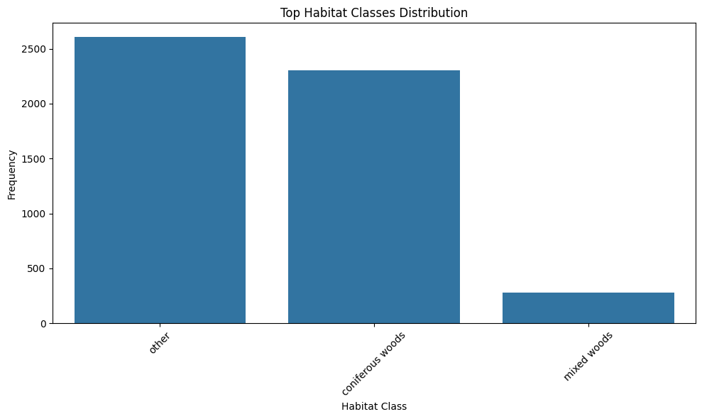
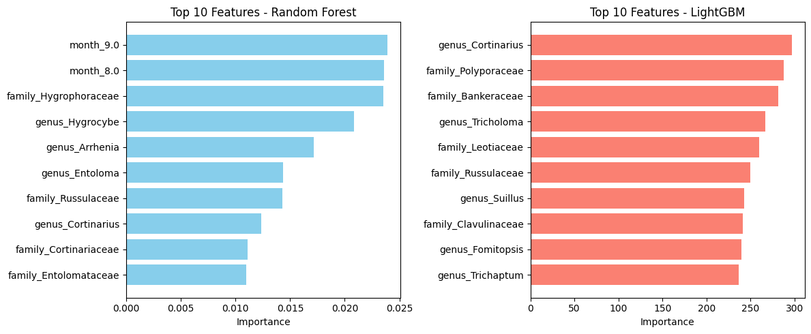
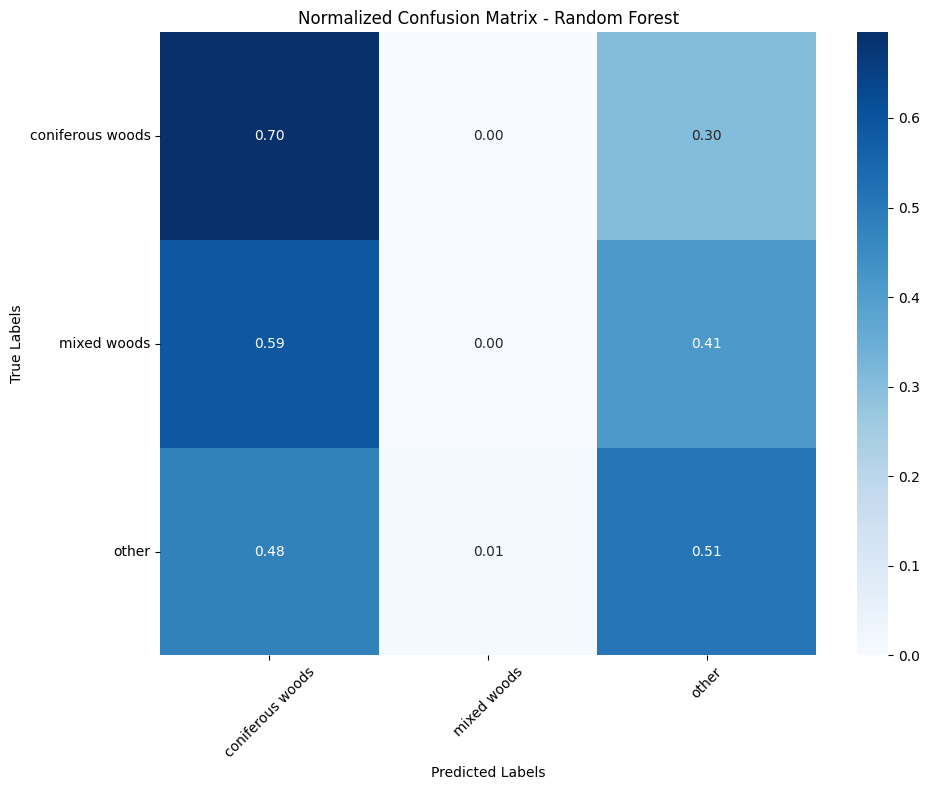
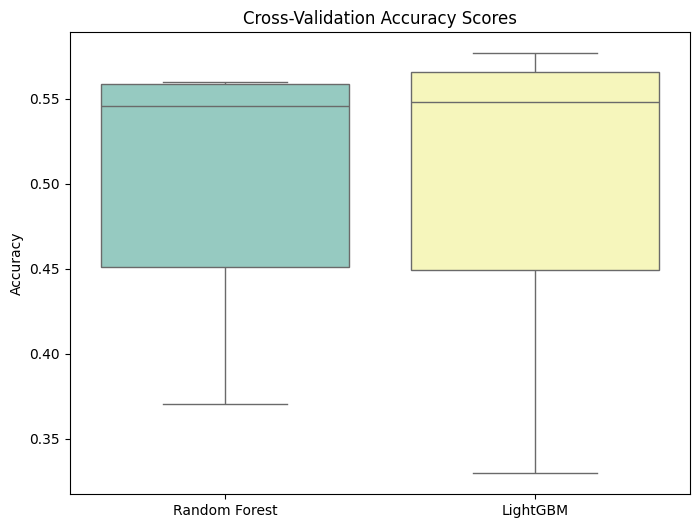

# Fungal Habitat Prediction

This project aims to predict fungal habitat types based on various biological, geographical, and seasonal data using machine learning. By testing and tuning multiple models, including Random Forest and LightGBM, the goal was to improve predictive accuracy and understand the key features impacting habitat prediction.

## Project Overview

**Technologies Used**: Python, Pandas, scikit-learn, LightGBM, RandomForest, Seaborn, Matplotlib  
**Dataset**: [occurrences.csv](occurrences.csv) - This dataset includes fungal occurrences with information on taxonomy, location, and environment.

### Project Workflow

1. **Data Loading and Exploration**: 
   - Loaded the dataset and performed an initial exploration of its structure and contents.

2. **Data Cleaning and Preparation**: 
   - Cleaned the dataset by removing missing values and normalizing habitat labels.
   - Encoded categorical variables using one-hot encoding and standardized features.

3. **Model Building**: 
   - Used Random Forest and LightGBM models.
   - Implemented hyperparameter tuning via GridSearchCV to optimize model performance.
   - Evaluated models based on accuracy and cross-validation scores.

4. **Results and Visualization**:
   - Displayed model metrics including precision, recall, and F1 score for each habitat class.
   - Visualized feature importance, habitat class distribution, and ROC curves.

---

## Results and Visualizations

### Habitat Class Distribution


### Feature Importances


### Confusion Matrix


### Cross-Validation Accuracy


### Metrics by Habitat Class (Precision, Recall, F1 Score)


### ROC Curve for Multi-Class Classification
.png)

---

## Key Findings

- **Top Predictive Features**: The top features varied slightly between Random Forest and LightGBM, though both models emphasized features such as family, genus, and location.
- **Habitat Class Prediction**: The precision, recall, and F1 scores for the habitat classes highlighted that certain classes like "Coniferous Woods" were easier to predict than others.
- **Cross-Validation Accuracy**: Both models performed comparably, with slight differences in cross-validation accuracy.

---

## How to Run This Project

1. Clone the repository:
   ```bash
   git clone https://github.com/yourusername/Fungal_Habitat_Prediction.git

2. Install Dependencies: Ensure you have the required libraries installed:
   ```bash
   pip install pandas numpy scikit-learn lightgbm matplotlib seaborn
3. Run the Jupyter Notebook: Open the Jupyter Notebook file to execute the analysis and visualizations.
   ```bash
   jupyter notebook Fungal_Habitat_Prediction.ipynb
