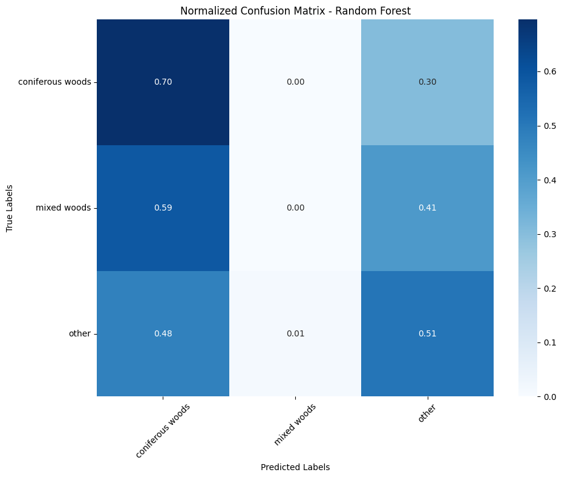
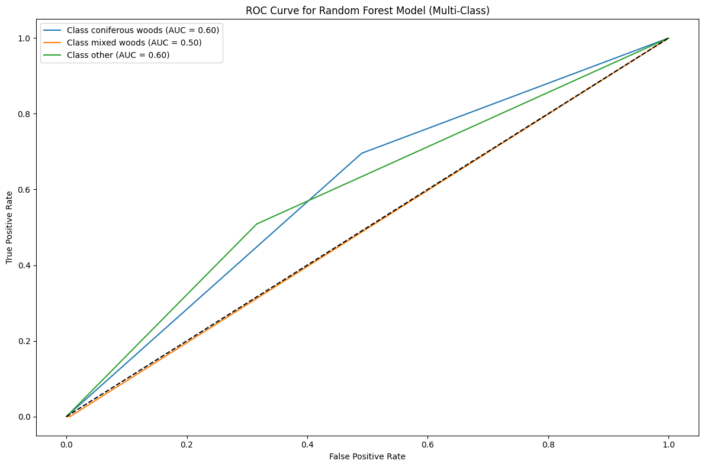
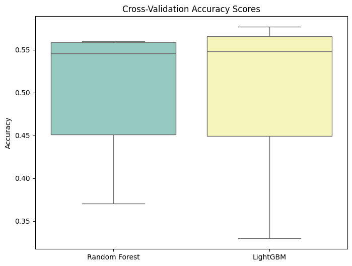
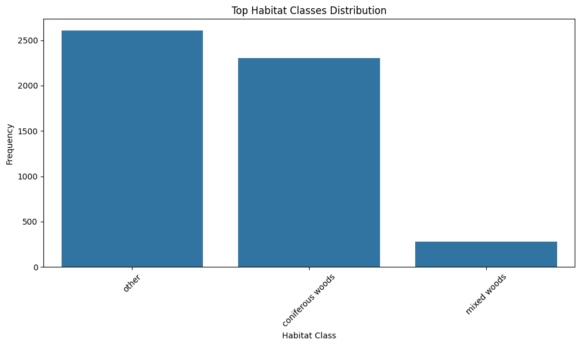
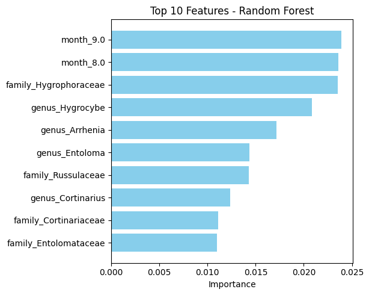
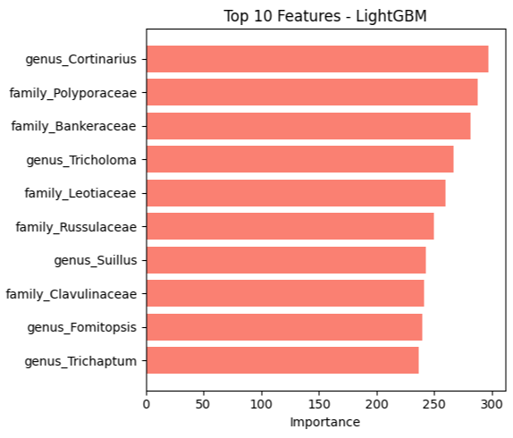
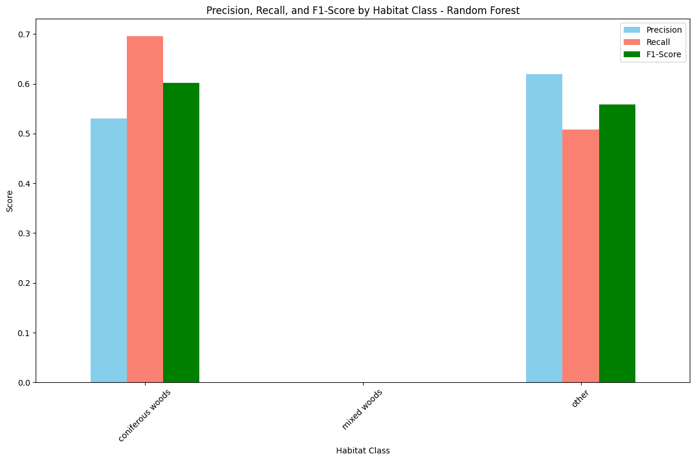

# Fungal Habitat Prediction Using Taxonomic and Observation Data

Predicting the habitat type of fungal specimens from taxonomic classification and observation metadata, using Random Forest and LightGBM.

**Stack**: Python, pandas, NumPy, scikit-learn, LightGBM, Matplotlib, Seaborn

## Overview

Herbarium and citizen-science fungal records are rich in taxonomic detail but often have inconsistent or missing habitat annotations. This project explores whether a specimen's **habitat type** can be predicted from its **taxonomy** (family, genus) and **observation month** alone — a multi-class classification problem framed as a step toward automatically filling in or validating habitat metadata for ecological and conservation research.

## Dataset

The data (`occurrences.csv`) is a Darwin Core–style export of preserved fungal specimen records (institution code `FNL`), each linking back to an individual record on [MyCoPortal](https://www.mycoportal.org/). The raw file has **6,162 records across 97 fields** (taxonomy, collector, locality, dates, etc.); the vast majority of records are from Newfoundland and Labrador, Canada.

Only four columns are used for modeling:

| Column | Role | Notes |
|---|---|---|
| `family` | feature | fungal family — 135 distinct values in the cleaned data |
| `genus` | feature | fungal genus — 367 distinct values |
| `month` | feature | month of observation — after cleaning, effectively 4 values (`0`, `8`, `9`, `10`); **90% of records are from September**, reflecting when field surveys ("forays") took place rather than a true ecological signal |
| `habitat` | target | standardized into 3 classes (see below) |

After dropping rows with a missing value in any of these four columns, **5,184 of the 6,162 records** remain.

The raw `habitat` field is free text with over 300 distinct raw strings (e.g. `"Coniferous Woods"`, `"coniferous woods"`, `"Coniferous wood"`, `"Coniferous forest"` all referring to the same habitat). The notebook standardizes this into three target classes:

| Habitat class | Records | Share |
|---|---|---|
| `other` | 2,604 | 50.2% |
| `coniferous woods` | 2,302 | 44.4% |
| `mixed woods` | 278 | 5.4% |

`other` is a catch-all for every raw label outside the 5 most frequent raw strings, so it is not a single ecologically coherent habitat — this is discussed further under [Limitations](#limitations).

## Preprocessing & Feature Engineering

As implemented in `Fungal_Habitat_Prediction.ipynb`:

1. Load `occurrences.csv` (`ISO-8859-1` encoding) and keep only `family`, `genus`, `month`, `habitat`; drop rows with any missing value among them (6,162 → 5,184 rows).
2. Standardize `habitat`: keep the 5 most frequent raw label strings, relabel everything else as `"Other"`, lowercase and strip whitespace, then merge `"coniferous forest"` into `"coniferous woods"` — yielding the 3 final classes above.
3. One-hot encode `family`, `genus`, and `month` (`pandas.get_dummies`, `drop_first=True`), producing a **503-column** feature matrix.
4. Label-encode the target (`coniferous woods` = 0, `mixed woods` = 1, `other` = 2).
5. Standardize all features with `StandardScaler`.
6. Stratified 80/20 train/test split (`random_state=42`) → **4,147 training rows / 1,037 test rows** (460 coniferous woods, 56 mixed woods, 521 other in the test set).

## Models Compared

Two classifiers are tuned with `GridSearchCV` over `StratifiedKFold(n_splits=5)`, optimizing accuracy:

- **Random Forest** (`RandomForestClassifier`) — grid over `n_estimators` ∈ {50, 100, 150}, `max_depth` ∈ {10, 20, None}, `min_samples_split` ∈ {2, 5, 10}.
- **LightGBM** (`LGBMClassifier`) — grid over `num_leaves` ∈ {31, 50, 70}, `learning_rate` ∈ {0.01, 0.1, 0.2}, `n_estimators` ∈ {50, 100, 150}.

## Results

All numbers below are computed on the held-out 1,037-row test set (verified by re-running the notebook's pipeline end-to-end).

### Test accuracy

| Model | Accuracy |
|---|---|
| Random Forest | 56.41% |
| LightGBM | 57.96% |

For context, always predicting the majority class (`other`, 50.2% of the data) would already score close to 50% accuracy, so both models offer only a modest improvement over a naive baseline.

### Per-class precision / recall / F1

**Random Forest**

| Habitat | Precision | Recall | F1-score |
|---|---|---|---|
| Coniferous woods | 53% | 69.6% | 60.2% |
| Mixed woods | 0% | 0% | 0% |
| Other | 61.9% | 50.9% | 55.8% |

**LightGBM**

| Habitat | Precision | Recall | F1-score |
|---|---|---|---|
| Coniferous woods | 55% | 62% | 58% |
| Mixed woods | 0% | 0% | 0% |
| Other | 61% | 61% | 61% |

Neither model correctly predicts a single `mixed woods` case (56 of 1,037 test rows) — its predictions collapse entirely into the other two classes, as shown in the confusion matrix below.

### Confusion matrix (Random Forest, row-normalized)



### ROC curve (Random Forest, one-vs-rest)

AUC: coniferous woods = 0.60, mixed woods = 0.50 (no better than random), other = 0.60.



Note: this curve is generated from hard class predictions rather than predicted probabilities, so each class reduces to a single operating point (visible as the two-segment lines in the plot) instead of a smooth probability-ranked curve.

### 5-fold cross-validation accuracy



### Habitat class distribution



### Feature importance

Random Forest ranks `month_9.0` / `month_8.0` and family `Hygrophoraceae` / genus `Hygrocybe` as the top predictors. LightGBM instead ranks genus `Cortinarius` and family `Polyporaceae` highest — the two models do not agree on which taxa are most predictive.




### Precision / recall / F1 by class (Random Forest)



## Reproducing the Analysis

### Dependencies

```
pandas
numpy
scikit-learn
lightgbm
matplotlib
seaborn
```

### Steps

1. Clone the repository — `occurrences.csv` is included at the repo root.
2. Install the dependencies above (e.g. `pip install pandas numpy scikit-learn lightgbm matplotlib seaborn`).
3. Open `Fungal_Habitat_Prediction.ipynb` in Jupyter. The notebook was originally run in Google Colab and hardcodes `dataset_path = '/content/occurrences.csv'` — update this to a local path (e.g. `'occurrences.csv'`) before running.
4. Run the notebook's single cell top to bottom; it performs the full pipeline — load, clean, encode, tune both models, evaluate, and generate all plots — in one pass.

## Limitations

- **Severe class imbalance**: `mixed woods` makes up only 5.4% of the data, and both models fail to predict it at all (0% recall).
- **Coarse target labels**: `other` is a catch-all for every raw habitat string outside the top 5 most frequent, merging many ecologically distinct habitats (e.g. bog, heath, field/lawn/meadow, broadleaved woods) into one class.
- **Inconsistent source labels**: the raw `habitat` field has 300+ free-text variants; only the most frequent strings are standardized, so residual noise likely remains within each class.
- **Minimal feature set**: only taxonomic family/genus and observation month are used. Other fields present in the raw data (e.g. latitude/longitude, substrate, elevation) are not incorporated, despite being plausible predictors of habitat.
- **Low-variance month feature**: 90% of the cleaned records were observed in a single month (September), so `month` likely encodes field-survey timing/effort rather than a genuine ecological signal, even though it ranks as a top Random Forest feature.
- **High-dimensional, sparse encoding**: one-hot encoding 135 families and 367 genera yields 503 features for only 4,147 training rows, which increases the risk of overfitting to rare categories.
- **ROC/AUC computed from hard predictions**: the ROC curves use binarized class predictions rather than predicted probabilities, so the resulting AUC values should be read as a rough single-operating-point summary rather than a full probability-ranking metric.
- **Modest overall accuracy**: both models perform only somewhat better than a naive majority-class baseline (~50%), indicating that family, genus, and month alone are weak predictors of habitat for this dataset.

## License

MIT License — see [LICENSE](LICENSE).
