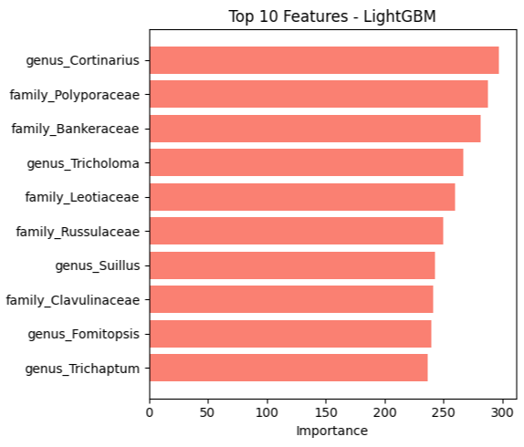

# Fungal Habitat Prediction Using Taxonomic and Observation Data

**Technologies**: Python, NumPy, scikit-learn, Random Forest, LightGBM, Matplotlib, Seaborn

## Objective
This project aims to predict fungal habitat types based on taxonomic classification and observation data, providing insights for conservation efforts and ecological research.

## Key Contributions
- Implemented **Random Forest** and **LightGBM** classifiers to model and predict fungal habitats.
- Conducted extensive **data preprocessing** and standardization of categorical values to enhance model performance.
- Evaluated and visualized model performance, highlighting key metrics and identifying strengths and limitations across habitat classes.

## Results
**Initial Data Shape**: (6162 rows, 97 columns)

After preprocessing and filtering, the dataset was refined to include only the relevant fields for model training and testing. The following are key performance results:

### Model Performance Metrics

**1. Random Forest**  
- **Accuracy**: 56.41%
- **Classification Report**:
    - **Coniferous Woods**: Precision = 53%, Recall = 69.6%, F1-Score = 60.2%
    - **Mixed Woods**: Precision = 0%, Recall = 0%, F1-Score = 0%
    - **Other**: Precision = 61.9%, Recall = 50.9%, F1-Score = 55.8%
- **AUC Scores**:
    - Coniferous Woods: 0.60
    - Mixed Woods: 0.50
    - Other: 0.60

**2. LightGBM**  
- **Accuracy**: 57.96%
- **Classification Report**:
    - **Coniferous Woods**: Precision = 55%, Recall = 62%, F1-Score = 58%
    - **Mixed Woods**: Precision = 0%, Recall = 0%, F1-Score = 0%
    - **Other**: Precision = 61%, Recall = 61%, F1-Score = 61%
  
### Visualization Outputs

#### 1. Habitat Class Distribution  

#### 2. Feature Importance  
**Random Forest**  
  

**LightGBM**  

#### 3. Normalized Confusion Matrix - Random Forest  

#### 4. Cross-Validation Accuracy Scores  

#### 5. Precision, Recall, and F1 Score by Habitat Class - Random Forest  

#### 6. ROC Curve - Random Forest  

## Dataset Overview
| Column | Description |
|--------|-------------|
| `family` | Fungal family classification |
| `genus` | Fungal genus classification |
| `month` | Month of observation |
| `habitat` | Habitat type, standardized and used as target variable |

## Usage

1. **Download the dataset**: `occurrences.csv`
2. **Run the code**: The `.ipynb` notebook contains the full analysis, or execute the `.py` script version for a streamlined run.

---

This project demonstrates the initial potential for using classification algorithms to predict fungal habitats, although improvement is needed for challenging categories like 'mixed woods.' Future work could focus on refining categorical balancing and enhancing feature engineering to boost model accuracy and robustness across all habitat classes.
